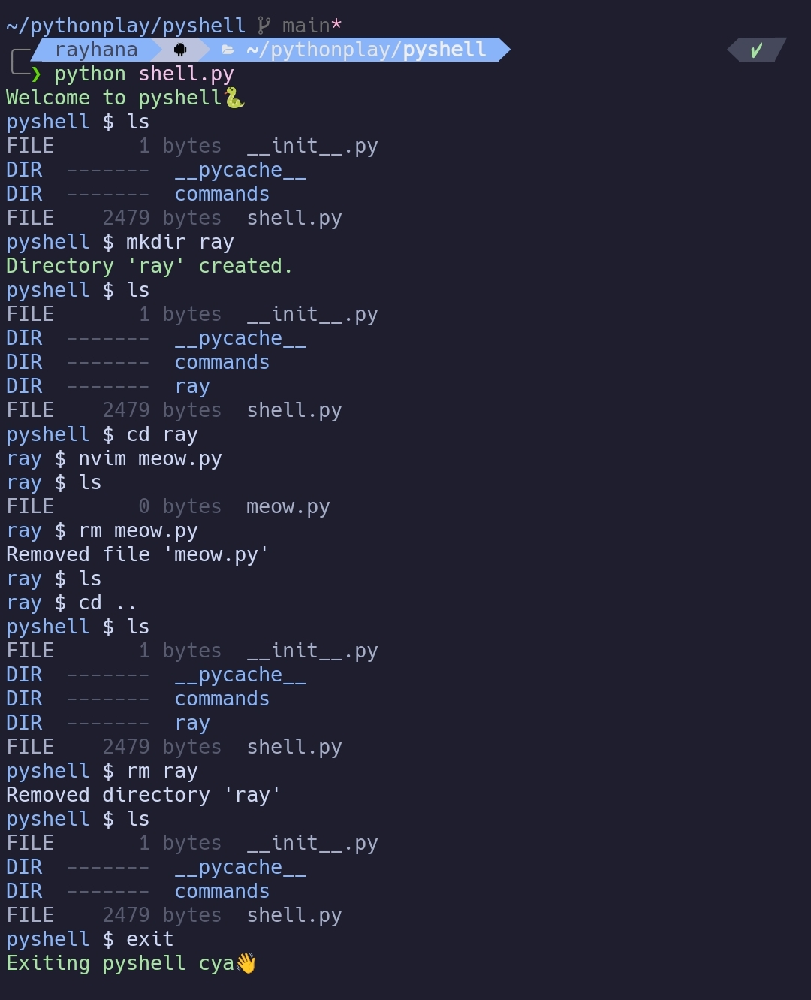

# PyShell 🐍

A mini shell written in Python that lets you navigate directories, create or remove files and folders, and run basic shell commands - all from scratch.

## Features
- Custom shell prompt that shows your current directory
- Commands: `ls`, `cd`, `mkdir`, `rm`, `cat`, `pwd` and more
- File size display for easy reference
- Color-coded output for directories and files
- Minimal, fun, and terminal-friendly design

## Screenshot
Here’s what it looks like in action:



## Run It
Clone and run:

```bash
git clone https://github.com/Rehana-Rahman/Pyshell.git
cd pyshell
python shell.py
